## 搭建自己的chatgpt

##步骤1：域名购买
推荐阿里云的：https://wanwang.aliyun.com/domain/searchresult
注意点： 1.买完以后记得解析你服务器公网ip    
       2.开放你的安全组端口：80,443等
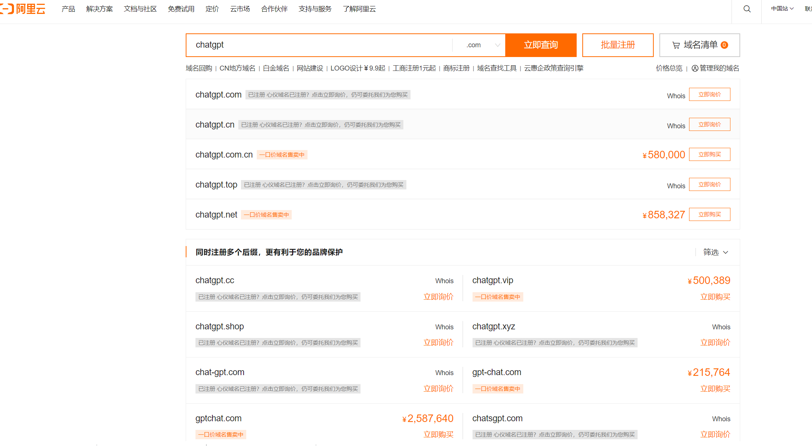

## 步骤2：服务器购买
 这里推荐购买雨云的：https://www.rainyun.com/home
优势：1.国内无需备案   
     2.无需挂梯子

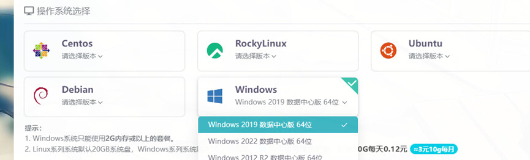
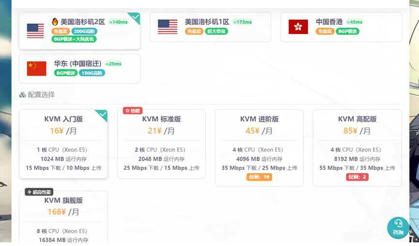
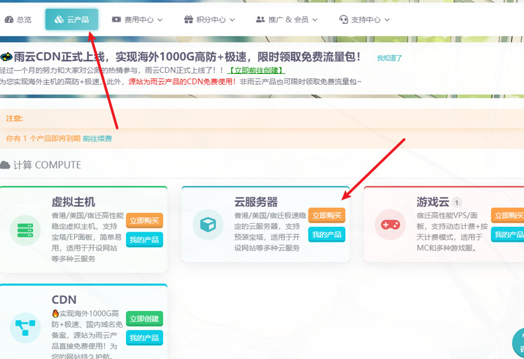

## 步骤3：宝塔部署
参考链接：https://www.kkkliao.cn/?id=42
下载网络程序的代码，按照如下操作：

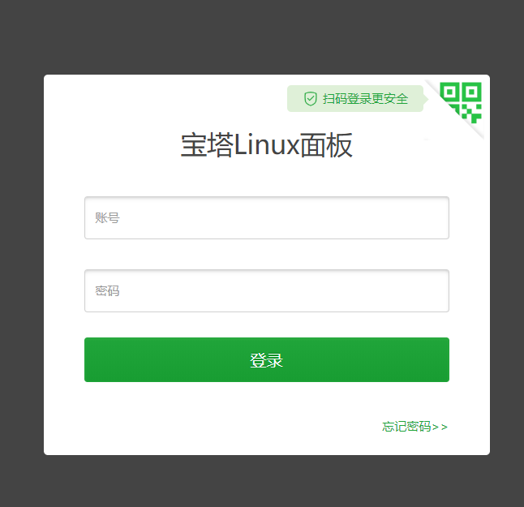
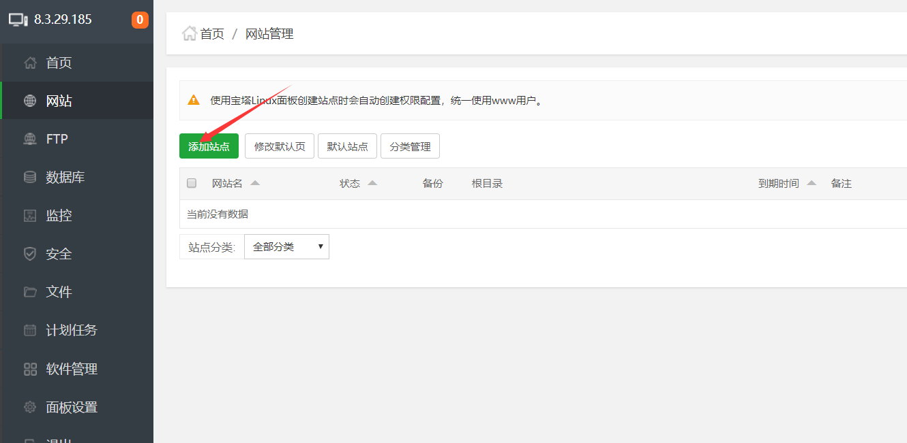
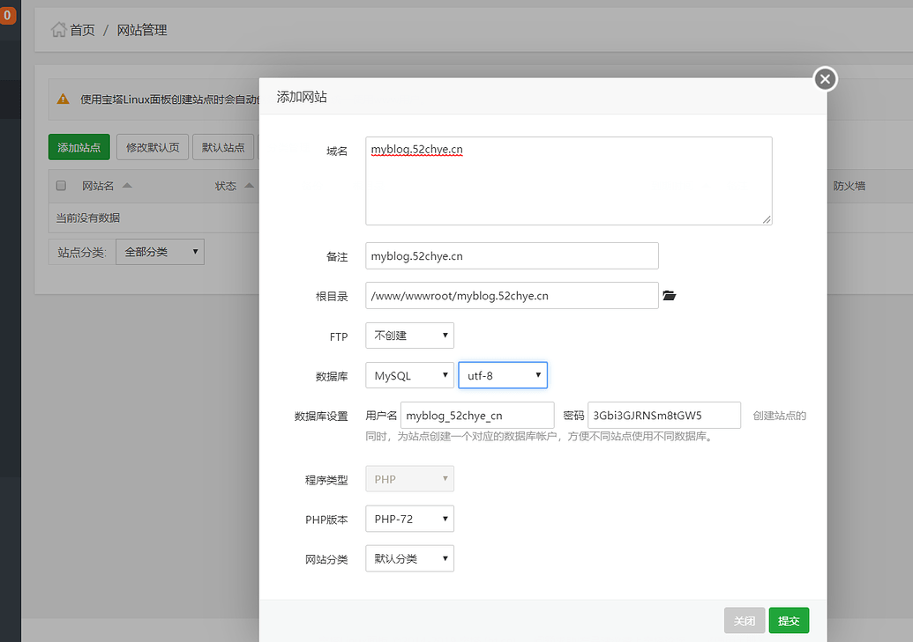
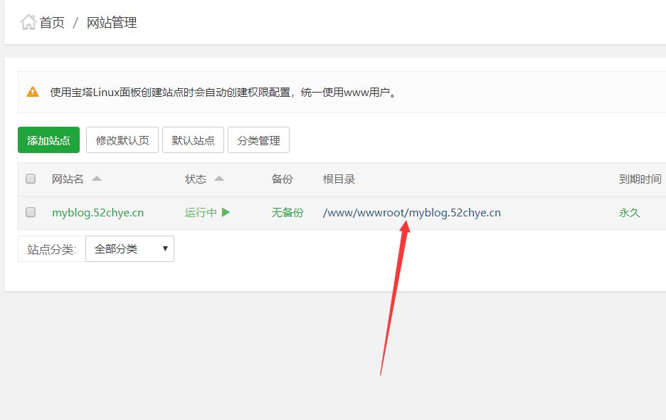
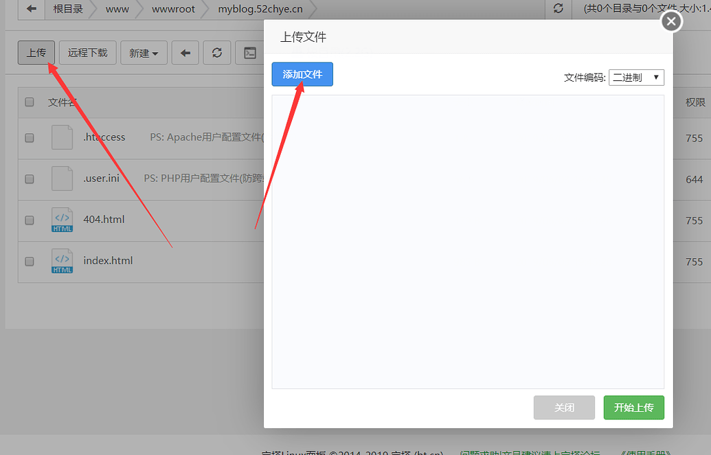

## 最后我们就看到前端和后台了
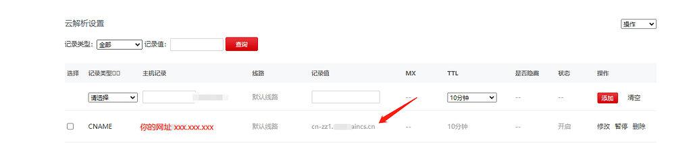
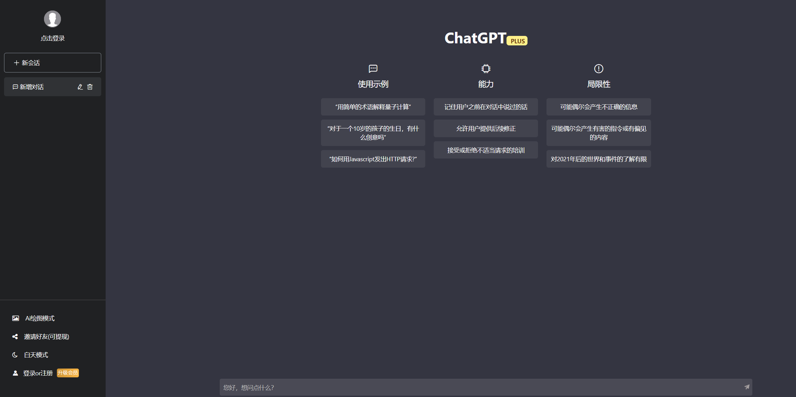

## 希望得到大家支持，继续编写

